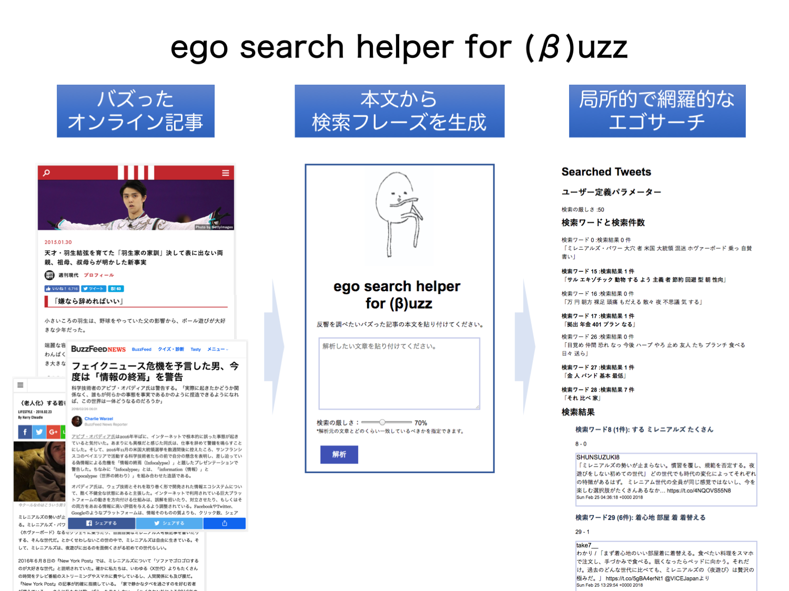

# エゴサーチヘルパー for buzz

エゴサーチヘルパー for Buzzは、オンラインで記事がバズった時のための反響収集支援ツールです。記事タイトル、執筆者を使った従来のエゴサーチでは拾えない、コアな反響を収集することを目指しています。ユーザーはバズが起きた記事の本文をコピペし、エゴサーチヘルパーはその文章を解析します。記事から語彙リストを生成し、twitterで検索をかけます。詳しい使い解説は[ego search helperとは](https://ego.kzkz.space/detail)を参照ください。

https://ego.kzkz.space/

## サーバーの構成
- flask app
- uwsgi
- nginx
- Ubuntu 16.04
- Conoha VPS

## アップデート
- 2/25/18「検索の厳しさ」をパラメーターとして設定できるようになりました。検索ワードの１単位が句読点間から句点間になりました。
検索結果に、検索ワードとヒット数が表示されるようになりました。
- 2/19/18 公開しました。https://ego.kzkz.space/
